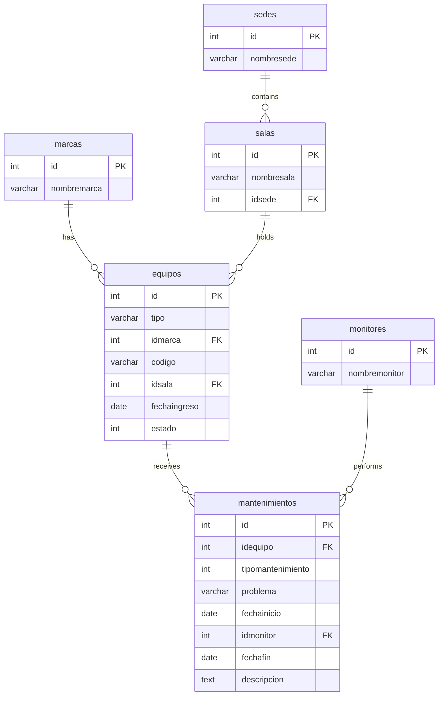

## Entity relationship overview



## Tables

### marcas

Stores equipment brands (manufacturers).

| Column | Type | Constraints | Description |
|--------|------|-------------|-------------|
| `id` | `int(11)` | `NOT NULL AUTO_INCREMENT PRIMARY KEY` | Unique brand identifier |
| `nombremarca` | `varchar(100)` | `NOT NULL` | Brand name (e.g., Dell, Lenovo) |

**Example data:**

| id | nombremarca |
|----|-------------|
| 1 | Dell |
| 2 | Lenovo |
| 3 | Asus |
| 4 | Acer |

---

### sedes

Stores physical locations or campuses.

| Column | Type | Constraints | Description |
|--------|------|-------------|-------------|
| `id` | `int(11)` | `NOT NULL AUTO_INCREMENT PRIMARY KEY` | Unique location identifier |
| `nombresede` | `varchar(100)` | `NOT NULL` | Location name |

**Example data:**

| id | nombresede |
|----|------------|
| 1 | Bicentenario |
| 2 | Encarnación |
| 3 | Casa Obando |

---

### salas

Stores rooms or areas within a sede.

| Column | Type | Constraints | Description |
|--------|------|-------------|-------------|
| `id` | `int(11)` | `NOT NULL AUTO_INCREMENT PRIMARY KEY` | Unique room identifier |
| `nombresala` | `varchar(100)` | `NOT NULL` | Room name |
| `idsede` | `int(11)` | `NOT NULL FOREIGN KEY → sedes.id` | The location this room belongs to |

<Note>
  Deleting a sede that still has associated salas will fail due to the foreign key constraint. Remove all salas first, or set `ON DELETE CASCADE` in the schema if automatic deletion is preferred.
</Note>

---

### monitores

Stores technician records.

| Column | Type | Constraints | Description |
|--------|------|-------------|-------------|
| `id` | `int(11)` | `NOT NULL AUTO_INCREMENT PRIMARY KEY` | Unique technician identifier |
| `nombremonitor` | `varchar(100)` | `NOT NULL` | Full name of the technician |

<Info>
  "Monitor" in this context means a maintenance technician, not a display device.
</Info>

---

### equipos

Stores individual equipment items.

| Column | Type | Constraints | Description |
|--------|------|-------------|-------------|
| `id` | `int(11)` | `NOT NULL AUTO_INCREMENT PRIMARY KEY` | Unique equipment identifier |
| `tipo` | `varchar(100)` | `NOT NULL` | Equipment type (e.g., Laptop, Desktop, Printer) |
| `idmarca` | `int(11)` | `NOT NULL FOREIGN KEY → marcas.id` | The brand of this equipment |
| `codigo` | `varchar(100)` | `NOT NULL` | Asset code or serial number |
| `idsala` | `int(11)` | `NOT NULL FOREIGN KEY → salas.id` | The room where the equipment is located |
| `fechaingreso` | `date` | `NOT NULL` | Date the equipment was registered in the system |
| `estado` | `int(11)` | `NOT NULL DEFAULT 1` | Active status: `1` = active, `0` = inactive |

---

### mantenimientos

Stores maintenance job records.

| Column | Type | Constraints | Description |
|--------|------|-------------|-------------|
| `id` | `int(11)` | `NOT NULL AUTO_INCREMENT PRIMARY KEY` | Unique maintenance record identifier |
| `idequipo` | `int(11)` | `NOT NULL FOREIGN KEY → equipos.id` | The equipment this job was performed on |
| `tipomantenimiento` | `int(11)` | `NOT NULL` | Maintenance type: `1` = Preventive, `2` = Corrective |
| `problema` | `varchar(100)` | `NOT NULL` | Short description of the problem or task |
| `fechainicio` | `date` | `NOT NULL` | Date the maintenance job started |
| `idmonitor` | `int(11)` | `NOT NULL FOREIGN KEY → monitores.id` | The technician assigned to this job |
| `fechafin` | `date` | `DEFAULT NULL` | Date the job was completed (null if still in progress) |
| `descripcion` | `text` | `DEFAULT NULL` | Detailed notes or resolution description |

<Tip>
  A `fechafin` of `NULL` indicates the maintenance job is still open. Use this to identify equipment currently under repair.
</Tip>

## Foreign key relationships

| Foreign key | References | Description |
|-------------|------------|-------------|
| `equipos.idmarca` | `marcas.id` | Each equipment item has one brand |
| `equipos.idsala` | `salas.id` | Each equipment item is located in one room |
| `salas.idsede` | `sedes.id` | Each room belongs to one location |
| `mantenimientos.idequipo` | `equipos.id` | Each maintenance record belongs to one equipment item |
| `mantenimientos.idmonitor` | `monitores.id` | Each maintenance job is assigned to one technician |

## 180-day maintenance interval

The equipment page (`pages/equipos.php`) calculates the next scheduled maintenance date for each equipment item at display time using PHP. The main query fetches `MAX(ma.fechafin)` — the date the most recent maintenance was **completed**:

```sql
SELECT e.id, e.codigo, e.tipo, e.idmarca, e.idsala, e.fechaingreso,
       e.estado, m.nombremarca, s.nombresala, MAX(ma.fechafin) AS fechafin
FROM equipos e
LEFT OUTER JOIN marcas m ON e.idmarca = m.id
LEFT OUTER JOIN salas s ON e.idsala = s.id
LEFT OUTER JOIN mantenimientos ma ON e.id = ma.idequipo
GROUP BY e.id
```

The PHP rendering logic then calculates the next date:

```php
$fechault = $row['fechafin'];
if ($fechault !== NULL) {
    // Has prior maintenance: next date = last completion date + 180 days
    $fechasigui = new DateTime($fechault);
    $fechasigui->add(new DateInterval('P180D'));
    echo $fechasigui->format('Y-m-d');
} else {
    // Never maintained: next date = entry date + 180 days
    $fechasigui = new DateTime($fechaingreso);
    $fechasigui->add(new DateInterval('P180D'));
    echo $fechasigui->format('Y-m-d');
}
```

Key points:
- The interval is based on `fechafin` (completion date of last maintenance), **not** `fechainicio`.
- If equipment has never been maintained (`fechafin IS NULL`), the next date is calculated from `fechaingreso` (entry date) + 180 days.
- The application displays the calculated date in plain text — there is no automatic overdue flagging in the UI.

## Full schema DDL

```sql
CREATE TABLE `marcas` (
  `id` int(11) NOT NULL AUTO_INCREMENT,
  `nombremarca` varchar(100) NOT NULL,
  PRIMARY KEY (`id`)
) ENGINE=InnoDB DEFAULT CHARSET=latin1;

CREATE TABLE `sedes` (
  `id` int(11) NOT NULL AUTO_INCREMENT,
  `nombresede` varchar(100) CHARACTER SET latin1 NOT NULL,
  PRIMARY KEY (`id`)
) ENGINE=InnoDB DEFAULT CHARSET=utf8;

CREATE TABLE `salas` (
  `id` int(11) NOT NULL AUTO_INCREMENT,
  `nombresala` varchar(100) NOT NULL,
  `idsede` int(11) NOT NULL,
  PRIMARY KEY (`id`),
  CONSTRAINT `fksalasede` FOREIGN KEY (`idsede`) REFERENCES `sedes` (`id`)
) ENGINE=InnoDB DEFAULT CHARSET=latin1;

CREATE TABLE `monitores` (
  `id` int(11) NOT NULL AUTO_INCREMENT,
  `nombremonitor` varchar(100) NOT NULL,
  PRIMARY KEY (`id`)
) ENGINE=InnoDB DEFAULT CHARSET=latin1;

CREATE TABLE `equipos` (
  `id` int(11) NOT NULL AUTO_INCREMENT,
  `tipo` varchar(100) NOT NULL,
  `idmarca` int(11) NOT NULL,
  `codigo` varchar(100) NOT NULL,
  `idsala` int(11) NOT NULL,
  `fechaingreso` date NOT NULL,
  `estado` int(11) NOT NULL DEFAULT '1',
  PRIMARY KEY (`id`),
  CONSTRAINT `fkequipomarca` FOREIGN KEY (`idmarca`) REFERENCES `marcas` (`id`),
  CONSTRAINT `fkequiposala` FOREIGN KEY (`idsala`) REFERENCES `salas` (`id`)
) ENGINE=InnoDB DEFAULT CHARSET=latin1;

CREATE TABLE `mantenimientos` (
  `id` int(11) NOT NULL AUTO_INCREMENT,
  `idequipo` int(11) NOT NULL,
  `tipomantenimiento` int(11) NOT NULL,
  `problema` varchar(100) NOT NULL,
  `fechainicio` date NOT NULL,
  `idmonitor` int(11) NOT NULL,
  `fechafin` date DEFAULT NULL,
  `descripcion` text,
  PRIMARY KEY (`id`),
  CONSTRAINT `fkmantenimientoequipo` FOREIGN KEY (`idequipo`) REFERENCES `equipos` (`id`),
  CONSTRAINT `fkmantenimientomonitor` FOREIGN KEY (`idmonitor`) REFERENCES `monitores` (`id`)
) ENGINE=InnoDB DEFAULT CHARSET=latin1;
```
