Sistema de Mantenimientos is a traditional PHP application with no framework. Each page is a self-contained PHP file that handles its own database queries and HTML output.

## Directory structure

| Path | Purpose |
|------|---------|
| `index.php` | Brand (marca) management — the application home page |
| `config/database.php` | MySQLi connection setup, shared by all pages |
| `layout/header.php` | HTML `<head>`, navigation bar, and opening `<body>` tag |
| `layout/footer.php` | Closing `</body>` and `</html>` tags |
| `pages/sedes.php` | Location (sede) management |
| `pages/salas.php` | Room (sala) management |
| `pages/monitores.php` | Technician (monitor) management |
| `pages/equipos.php` | Equipment (equipo) management |
| `pages/mantenimientos.php` | Maintenance job creation and editing |
| `pages/ver-mantenimientos.php` | Maintenance history view |
| `mantenimientos (1).sql` | Full database schema and seed data |

## Request lifecycle

Every request follows the same pattern:

```mermaid
flowchart LR
    A[Browser request] --> B[PHP page]
    B --> C[include config/database.php]
    C --> D[MySQLi query]
    D --> E[PHP processes result set]
    E --> F[include layout/header.php]
    F --> G[Render HTML table / form]
    G --> H[include layout/footer.php]
    H --> I[HTML response to browser]
```

1. The browser sends a GET or POST request to a PHP file.
2. The page includes `config/database.php` to obtain a `$dbConnection` handle.
3. One or more `mysqli_query()` calls fetch or mutate data.
4. The page includes `layout/header.php` to output the HTML preamble and navigation.
5. PHP loops over the result set and renders the HTML content (tables, forms, modals).
6. The page includes `layout/footer.php` to close the HTML document.

## Navigation structure

`layout/header.php` renders a top navigation bar with links to every module. There are six nav items:

| Label | Target file |
|-------|-------------|
| Inicio | `../index.php` (home link) |
| Marcas | `/index.php` |
| Monitores/Personas | `/pages/monitores.php` |
| Sedes | `/pages/sedes.php` |
| Salas | `/pages/salas.php` |
| Equipos | `/pages/equipos.php` |
| Mantenimientos | `/pages/mantenimientos.php` |

<Note>
  There is no dedicated "Ver Mantenimientos" nav item. The maintenance history page (`/pages/ver-mantenimientos.php`) is accessed via the **Ver** button on each row of the equipment table.
</Note>

## Form submission pattern

All data mutations follow a consistent pattern within the same PHP file:

<CardGroup cols={2}>
  <Card title="Create" icon="plus">
    An HTML form POSTs to the same page. PHP checks `$_SERVER['REQUEST_METHOD'] === 'POST'`, reads `$_POST` values, runs an `INSERT` query, then redirects back with `header('Location: ...')`.
  </Card>
  <Card title="Edit (load)" icon="pencil">
    Clicking an edit button sends `GET ?id=X&edit=true`. PHP detects `isset($_GET['edit'])`, fetches the record by `$_GET['id']`, and pre-fills the form fields.
  </Card>
  <Card title="Update (save)" icon="floppy-disk">
    The pre-filled form POSTs back to the same page. PHP reads `$_GET['id'] ?? 0` to determine whether to run `UPDATE` (id > 0) or `INSERT` (id = 0).
  </Card>
  <Card title="Delete" icon="trash">
    Clicking a delete button sends `GET ?id=X` (without an `edit` parameter). PHP detects that `$_GET['edit']` is not set and runs a `DELETE` query, then redirects.
  </Card>
</CardGroup>

<Warning>
  The current implementation uses `$_GET` for delete actions without CSRF protection or confirmation tokens. In a production deployment you should add a confirmation step and a CSRF token check.
</Warning>

## File-based routing

There is no router or front controller. URL paths map directly to PHP files:

| URL | Module |
|-----|--------|
| `/` or `/index.php` | Brand management (home page) |
| `/pages/marcas.php` | Brand management (alternate URL, identical to `index.php`) |
| `/pages/sedes.php` | Location management |
| `/pages/salas.php` | Room management |
| `/pages/monitores.php` | Technician management |
| `/pages/equipos.php` | Equipment management |
| `/pages/mantenimientos.php` | Maintenance management |
| `/pages/ver-mantenimientos.php?id=X` | Maintenance history for equipment ID X |

<Note>
  Because routing is file-based, adding a new module means creating a new PHP file in the appropriate directory and adding a link to `layout/header.php`.
</Note>

## Frontend stack

All frontend dependencies are loaded from CDNs inside `layout/header.php`. No build step is required.

| Library | Version | Purpose |
|---------|---------|---------|
| TailwindCSS | latest (CDN) | Utility-first CSS classes |
| Bootstrap | 4.x | Grid, navbar, modals, buttons |
| jQuery | 3.3.x | DOM manipulation, Bootstrap JS dependency |
| Popper.js | 1.x | Bootstrap dropdown and tooltip positioning |
